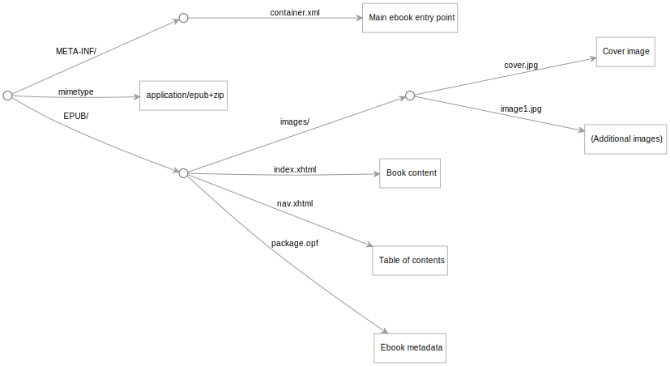

This project explores using the [Origami](https://weborigami.org/language) language to create an ebook in the [EPUB](https://en.wikipedia.org/wiki/EPUB) format.

Generally speaking, an EPUB file is a ZIP file containing a specific set of files. These files define things such as book metadata (title, author, etc), a table of contents, and XHTML pages for the chapter contents.

Origami is good for defining trees of content like this, so should be a reasonable way to programmatically generate an ebook in EPUB format. This project explores this idea to create a simple book using some myths from the related [Cherokee Myths](https://github.com/WebOrigami/cherokee-myths) sample Origami site.

The following define the book's contents, and represent what the authors needs to create:

- `markdown` contains markdown files for a number of stories; each file will become a chapter.
- `book.yaml` file contains book metadata.

The `src/ebook.ori` Origami file uses the above to define the complete tree of files necessary for the EPUB format. This includes translating the markdown to HTML, combining the chapters into an overall XHTML file, and generating a table of contents. The complete virtual tree looks like this:



To create a readable ebook, that virtual tree of files is compressed into ZIP format and saved as an `.epub` file.

This example is currently very simple: it assumes a flat hierarchy of chapters, and has no images or styling.

## Building

To preview the files that will go into the ebook:

```console
$ npm run preview
```

This will generate a `preview` folder containing everything that will go into the EPUB file.

To view the files in a browser:

```console
$ npm run serve
```

You can then browse files like the generated, virtual files like `EPUB/nav.xhtml`.

To build the ebook:

```console
$ npm run build
```

This will generate a `myths.epub` file that you should be able to open in an ebook reader app.
